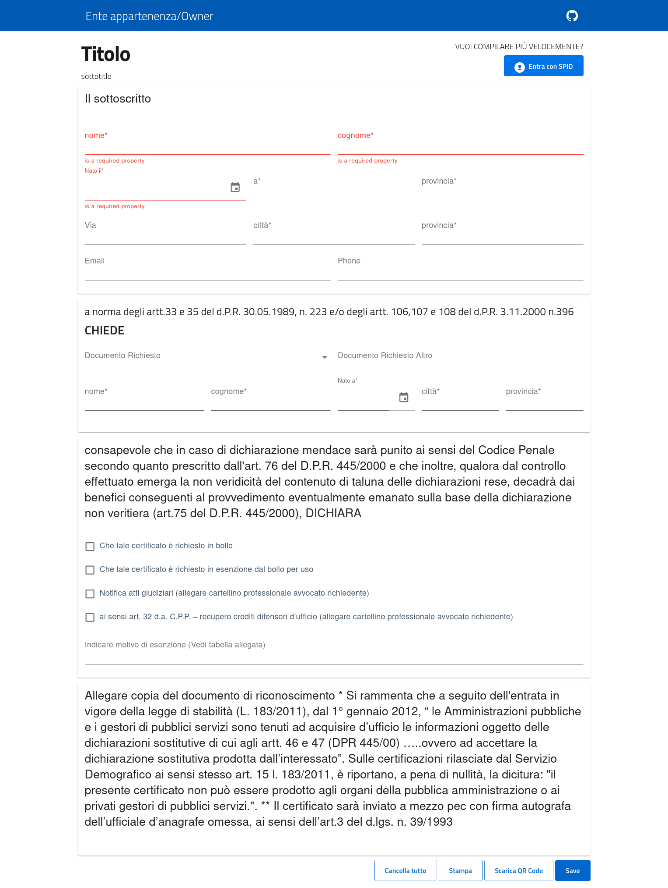

# Form PA



## Generate a valid JSON Schema
Using [this](https://jsonschema.net) service or any others found on internet create a simple JSON schema results a quite easy operation to do.

## Run

### ENV
`YAML_SOURCE` is the env var in charge to switch from `yaml` support over `json`.

### Local Dev
Install all dependencies and start
```bash
$ npm install
$ npm start
```

### Local Prod
Install all dependencies and build
```bash
$ npm install
$ npm run build
```
Then `./dist` will be ready to be served.


### Docker
Run with a preset json schema, stored in `public/schema/schema.json` and default uischema as well in `public/schema/uischema.json`. To overwrite them just mount a volume.
```bash
$ docker build . -t form-pa
$ docker run -it --rm -p 3000:80 form-pa
```

Or simply run docker replacing that schema with one supplied at runtime as:
```bash
$ docker build -f Dockerfile.dev . -t form-pa:dev
$ docker run -v ${PWD}/public/schema/schema.yaml:/usr/src/app/public/schema/schema.yaml -it --rm -p 3000:3000 -e YAML_SOURCE=true form-pa:dev
```

## License

form-pa is licensed under the [GNU Affero General Public License v3.0 or later](LICENSE)
license.
